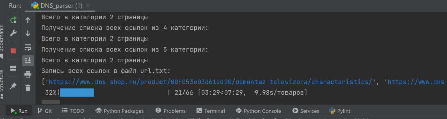
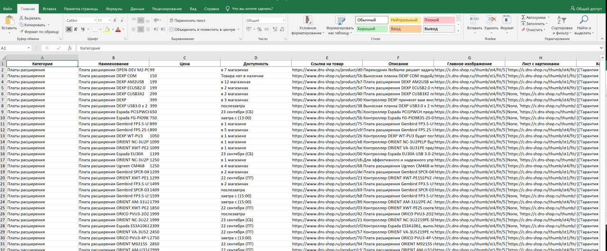

# Парсер данных с сайта магазина DNS.

---

Web-приложение, собирает информацию о товарах с сайта https://dns-shop.ru .
___

## Стек
- Python 3.10
- Selenium 4.3.0
- Beautiful Soup4  4.11.1
- undetected-chromedriver 2.1.1 
- Openpyxl 3.10
- tqdm 4.64
___

## Техническое задание

Собрать полный список товара из любых 5 категорий нижнего уровня и сохранить его в Exсel таблице.

Сохранить нужно следующую информацию о товаре:
- Категорию 
- Наименование 
- Цена 
- доступен или нет к продаже 
- Ссылка страницы с товаром 
- Ссылку на главное изображение 
- Ссылки на все изображения 
- Характеристики
- Описание

---
### Скриншоты работы
1) Работа скрипта:

2) Результат экспорта:
